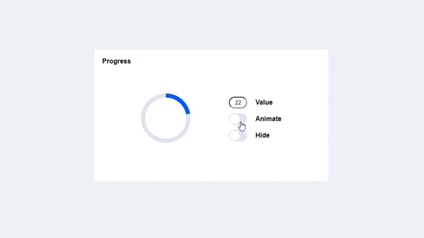

# progress-block

## Обзор
В этом проекте реализован прототип блока Progress для использования в мобильных web-приложениях. Основное предназначение блока отображать процесс выполнения процессов и их прогресс
выполнения.



## Атрибуты

- value (число): Значение прогресса в диапазоне от 0 до 100. Когда не передаем равен 0.

```html
<progress-block value="75"></progress-block>
```
- isAnimate (булево): Включает/выключает анимацию. Когда не передаем равен false.

```html
<progress-block isAnimate="true"></progress-block>
```
- isHide (булево): Скрывает/отображает элемент. Когда не передаем равен false.

```html
<progress-block isHide="true"></progress-block>
```
## Адаптивность
`progress-block` поддерживаeт адаптивность и автоматически подстраиваeтся под различные размеры экранов. 

## Технологии

- **TypeScript**
- **Web Components**
- **Vite**

## Ссылка на деплой
https://talion220.github.io/progress-block/
